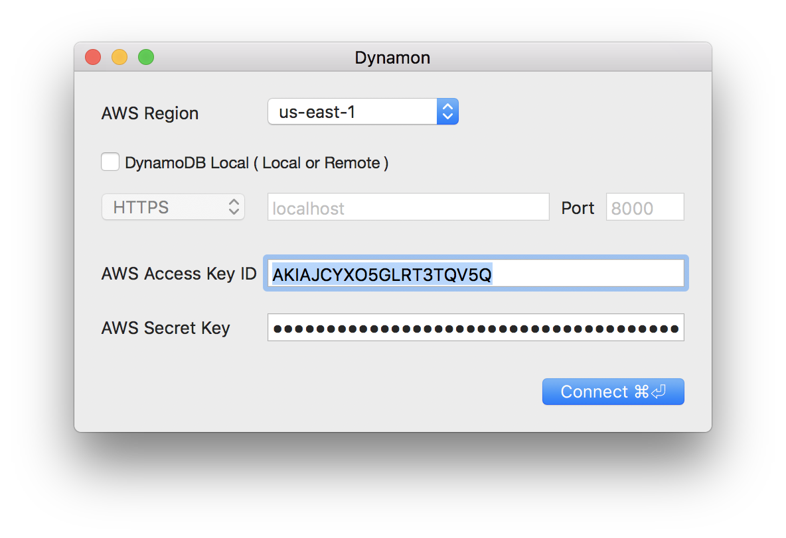
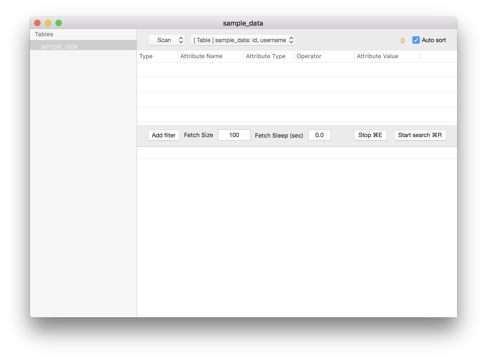
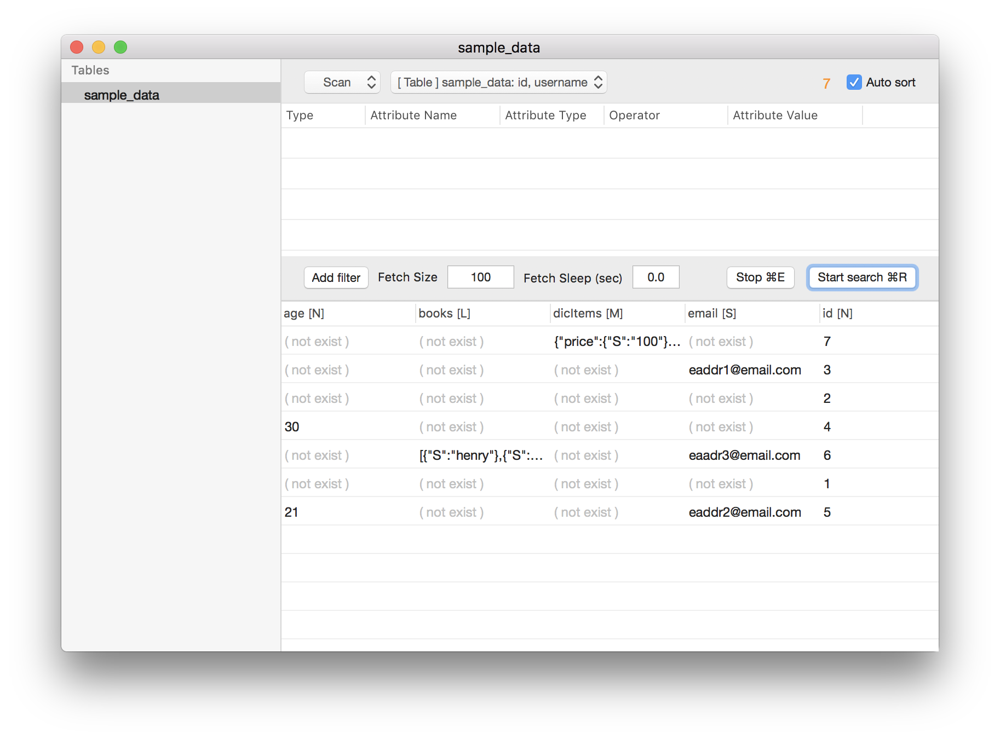
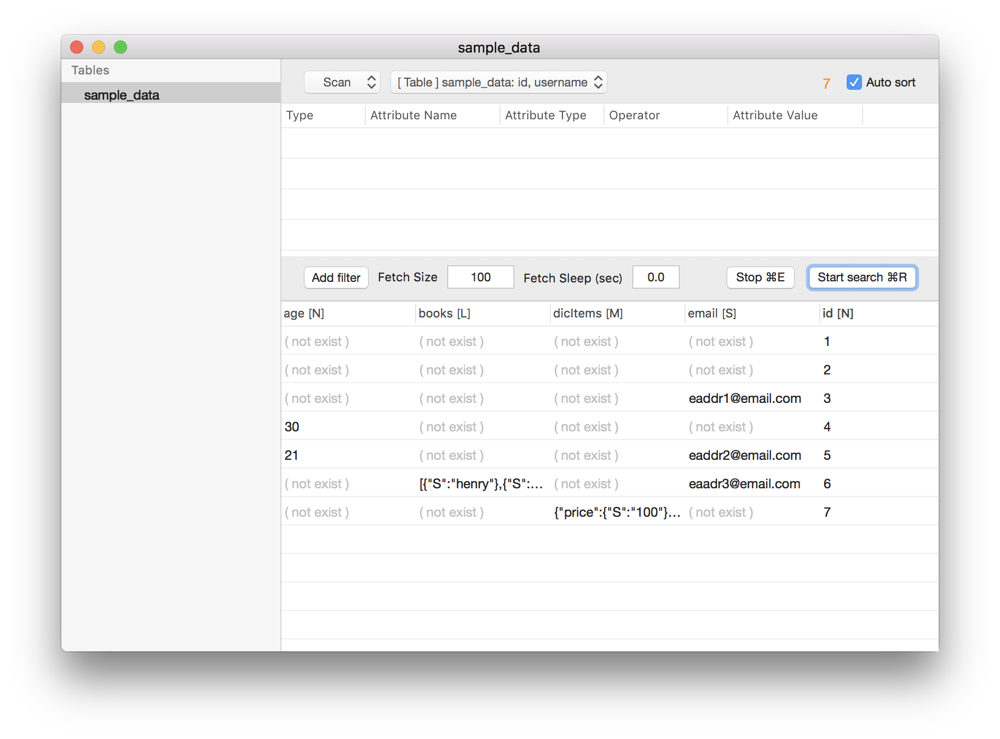
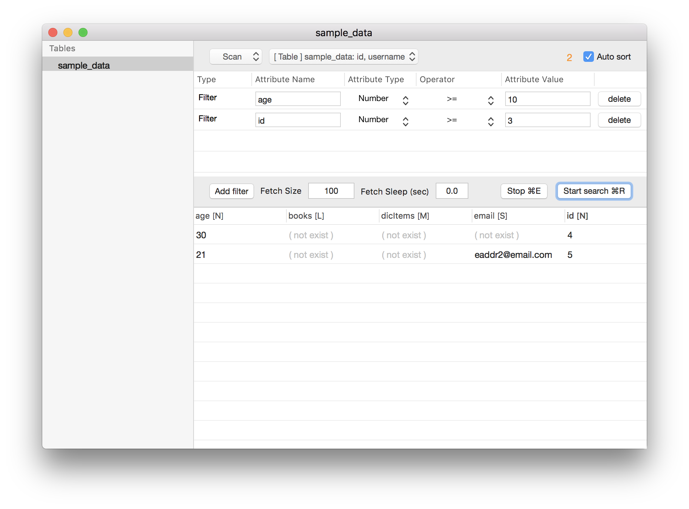
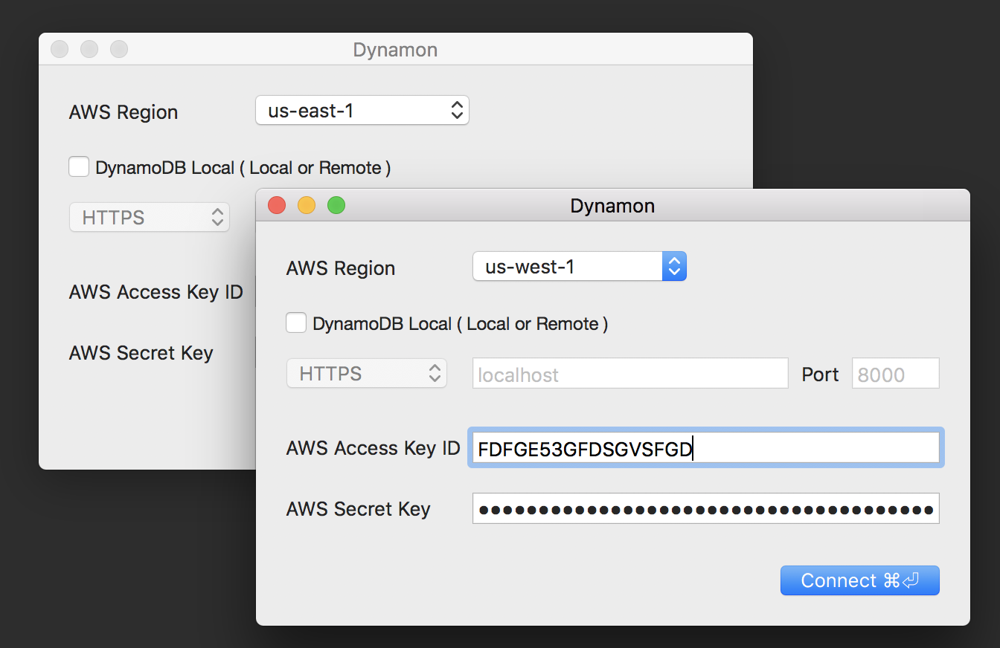
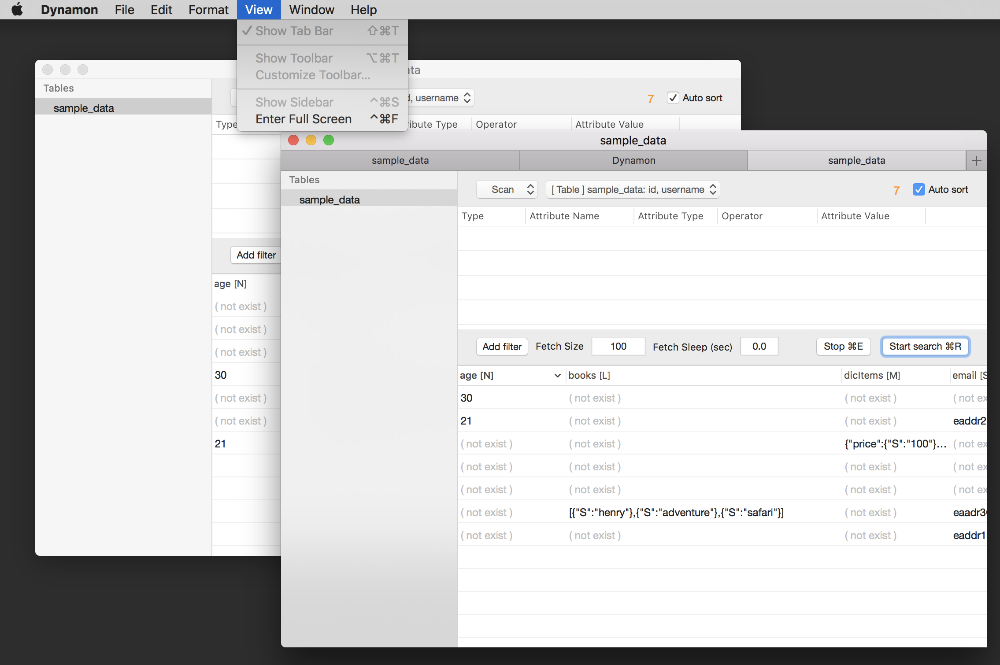
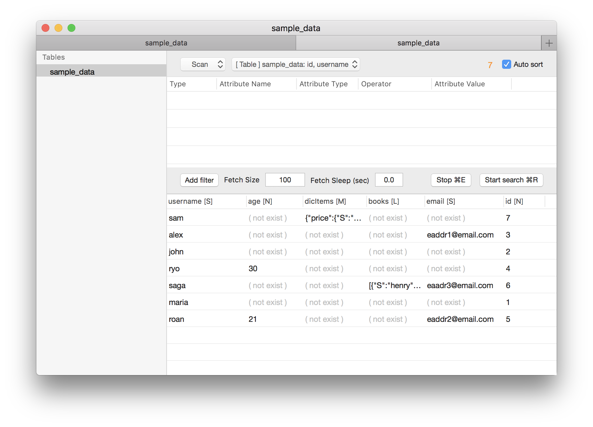

# Latest news
public my source

update version 1.0.6
- bugfix

# What is dynamon
dynamon is GUI Development tools of Amazon DynamoDB

# License
free


# Downloads
https://github.com/touchduck/dynamon/raw/master/Release/Dynamon-1.0.6.zip  

# System requirements  
Mac OSX 10.10 and higher.
  
# Need permissions  
AmazonDynamoDBFullAccess or AmazonDynamoDBReadOnlyAccess  

# Screenshot 1
Connect to Amazon DynamoDB  
Connect to Amazon DynamoDB-local  
  

# Screenshot 2
GUI
  
  
# Screenshot 3
Fetch size, Fetch sleep, Auto Sort  
  
  
# Screenshot 4
Multiple sort  
  
  
# Screenshot 5
Scan and dynamic filter  
  
  
# Screenshot 6
Query and dynamic filter  
  

# Screenshot 7
Multiple login


# Screenshot 8
Multiple tabs


# Screenshot 9
When you run it again, Keep width and order of columns



# How to compile

AWS SDK for C++ - GitHub
https://github.com/aws/aws-sdk-cpp.git

compile macOS static library
```
brew install cmake
cmake -DCUSTOM_MEMORY_MANAGEMENT=1 -DSTATIC_LINKING=1 -DBUILD_ONLY="core;s3;dynamodb"
make install
```
and build to xcode
